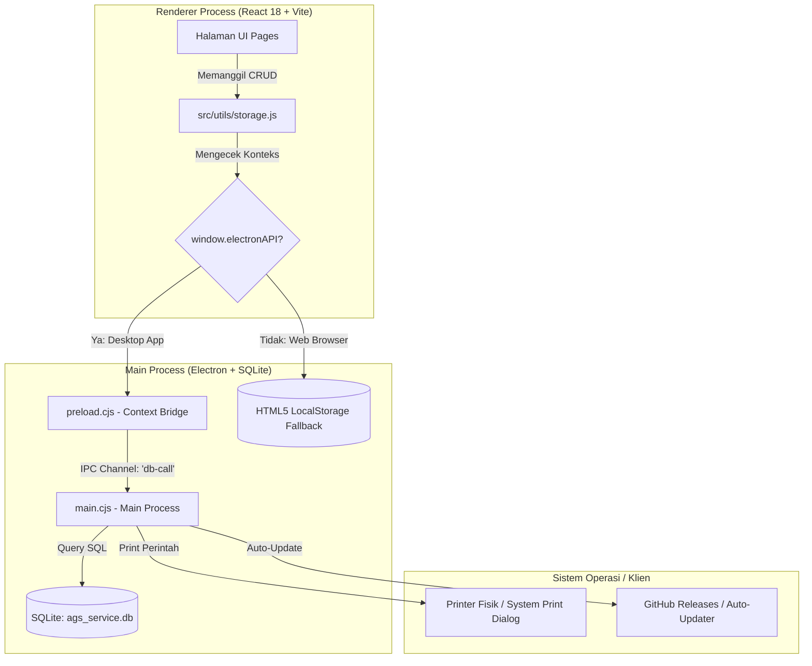

# AGS Techflow: Panduan Lengkap, Struktur Arsitektur & Manual Developer

Dokumen ini disusun secara lengkap dan terstruktur sebagai panduan referensi utama bagi pengembang (developer) aplikasi **AGS Techflow** (Manajemen Bengkel & Kasir Suku Cadang Laptop). Panduan ini dirancang khusus untuk memastikan bahwa ketika Anda kembali untuk melakukan pembaruan fitur (misalnya, tahun depan), Anda akan langsung memahami arsitektur sistem, skema basis data, aliran komunikasi data, serta tata cara menambah atau memodifikasi fitur aplikasi secara instan dan aman.

---

## DAFTAR ISI
1. [Tinjauan Arsitektur Sistem (High-Level Architecture)](#1-tinjauan-arsitektur-sistem-high-level-architecture)
2. [Anatomi & Struktur Folder Proyek](#2-anatomi--struktur-folder-proyek)
3. [Skema Basis Data SQLite & Model Data](#3-skema-basis-data-sqlite--model-data)
4. [Aliran Data & Logika Bisnis Utama (Core Logic)](#4-aliran-data--logika-bisnis-utama-core-logic)
5. [Panduan Developer Praktis: Menambahkan/Mengubah Fitur (Tahun Depan)](#5-panduan-developer-praktis-menambahkanmengubah-fitur-tahun-depan)
6. [Panduan Kompilasi, Build, & Packaging](#6-panduan-kompilasi-build--packaging)
7. [Penanganan Masalah & Pemeliharaan (Troubleshooting & Maintenance)](#7-penanganan-masalah--pemeliharaan-troubleshooting--maintenance)

---

## 1. Tinjauan Arsitektur Sistem (High-Level Architecture)

Aplikasi **AGS Techflow** dirancang sebagai aplikasi desktop hibrida modern menggunakan kerangka kerja (framework) **Electron** yang dipadukan dengan antarmuka berbasis **React 18** dan build-tool **Vite**.



### Penjelasan Proses & Keamanan (IPC Bridge):
1. **Renderer Process (Frontend)**:
   - Berupa antarmuka web interaktif yang dikompilasi dengan **Vite** ke dalam folder `dist/`.
   - Menggunakan **Tailwind CSS** untuk pewarnaan dan tata letak dinamis serta **Lucide React** sebagai pustaka ikon.
2. **Main Process (Backend Desktop)**:
   - Dikelola oleh berkas [main.cjs](file:///home/irfanfadila/sparepart-app/main.cjs).
   - Bertanggung jawab penuh terhadap siklus hidup aplikasi desktop, akses langsung ke filesystem, pembaruan otomatis via `electron-updater`, dan koneksi database SQLite lokal.
3. **Bridge / Preload Script (`preload.cjs`)**:
   - Sebagai gerbang keamanan (*security gate*). Menggunakan `contextBridge` untuk membatasi akses langsung frontend ke fitur Node.js. Fungsi database diekspos dengan aman melalui `window.electronAPI.dbCall`.

---

## 2. Anatomi & Struktur Folder Proyek

Berikut adalah peta struktur berkas dalam direktori proyek **sparepart-app**:

```
sparepart-app/
├── main.cjs                   # Backend Electron: Inisialisasi DB, IPC Handlers, Auto-Updater
├── preload.cjs                # Jembatan IPC aman antara Electron Main dan React Renderer
├── index.html                 # Template dasar HTML entry-point Vite
├── vite.config.js             # Konfigurasi compiler Vite & React Plugin
├── tailwind.config.js         # Konfigurasi utility-first styling Tailwind CSS
├── postcss.config.js          # Konfigurasi post-processing CSS
├── package.json               # Manifest dependensi proyek, skrip build, & konfigurasi packager
├── public/                    # Aset statis (logo.png, gambar statis, dll.)
└── src/                       # Kode sumber utama Frontend React
    ├── App.jsx                # File Utama: Navigasi Sidebar, Routing Halaman, & Skala Zoom
    ├── index.css              # Custom styling global, scrollbar, & utility cetak nota (@media print)
    ├── components/            # Komponen pakai ulang & Template Cetak
    │   ├── NotaServicePrint.jsx  # Desain Nota Jasa Servis (1/3 A4 & Kertas Continuous)
    │   ├── NotaKontan.jsx        # Desain Nota Penjualan Sparepart (1/3 A4 & Kasir)
    │   ├── CustomSelect.jsx      # Dropdown seleksi modern
    │   └── KalkulatorMarkup.jsx  # Fitur popup pembantu hitung margin keuntungan
    ├── utils/                 # Logika pembantu & Persistensi Data
    │   ├── storage.js         # CRUD Bridge Database: Mengarahkan data ke SQLite/LocalStorage
    │   └── helpers.js         # Format Rupiah, format tanggal, generator ID acak
    └── pages/                 # Modul-modul menu halaman utama
        ├── Dashboard.jsx      # Statistik, grafik omset harian, rekap stok habis/menipis
        ├── InputServisan.jsx  # Registrasi awal unit servis masuk & keluhan pelanggan
        ├── DataServisan.jsx   # Manajemen antrean pengerjaan servis & detail pembayaran DP
        ├── BukuHutang.jsx     # Log Piutang, riwayat cicilan, & cetak kuitansi mini thermal 58mm
        ├── DatabasePart.jsx   # Master Barang: inventarisasi, pencarian stok, edit harga sparepart
        ├── TransaksiPenjualan.jsx # Antarmuka Kasir untuk penjualan suku cadang langsung
        ├── LaporanPenjualan.jsx # Laporan transaksi, riwayat nota kasir, & grafik performa
        ├── CatatanKeuangan.jsx # Jurnal keuangan kas masuk/keluar & pembukuan otomatis
        ├── DataSupplier.jsx   # Modul Mitra & Kerjasama: Kelola supplier, outsource, reseller
        └── Pengaturan.jsx     # Ubah nama bengkel, alamat, no HP, & Backup/Restore database
```

---

## 3. Skema Basis Data SQLite & Model Data

Aplikasi menggunakan penyimpanan hibrida: database **SQLite** lokal berbasis `sql.js` WebAssembly jika berjalan sebagai aplikasi desktop, dan otomatis jatuh kembali ke **HTML5 LocalStorage** jika dijalankan langsung di penjelajah web biasa (sangat membantu untuk debugging cepat di localhost).

Berikut adalah DDL lengkap 7 tabel database yang dikelola secara otomatis di dalam berkas [main.cjs](file:///home/irfanfadila/sparepart-app/main.cjs):

```sql
-- 1. TABEL INVENTARIS SUKU CADANG (SPAREPARTS)
CREATE TABLE IF NOT EXISTS spareparts (
  id TEXT PRIMARY KEY,       -- ID Acak Unik (contoh: id-178021...)
  kode TEXT,                 -- Kode Barang unik / Barcode (contoh: HDMI 1.5M)
  kategori TEXT,             -- Kategori: 'Sparepart', 'Accessories', 'Unit New', 'Unit Second'
  deskripsi TEXT,            -- Deskripsi detail spesifikasi barang
  harga INTEGER,             -- Harga Jual (Rupiah)
  stok INTEGER,              -- Sisa stok fisik di gudang / toko
  keterangan TEXT            -- Catatan tambahan barang
);

-- 2. TABEL NOTA PENJUALAN KASIR (NOTAS)
CREATE TABLE IF NOT EXISTS notas (
  id TEXT PRIMARY KEY,       -- ID Unik
  nomorNota TEXT,            -- Nomor Seri Nota otomatis (format: AGS-YYYYMMDD-XXXX)
  tanggal TEXT,              -- Tanggal transaksi (format: YYYY-MM-DD)
  waktu TEXT,                -- Waktu transaksi (format: HH:MM:SS)
  namaCustomer TEXT,         -- Nama pembeli sparepart
  namaAdmin TEXT,            -- Nama kasir/admin yang melayani
  keterangan TEXT,           -- Catatan nota
  items TEXT,                -- Detail barang belanjaan (Disimpan sebagai JSON Stringified Array)
  total INTEGER,             -- Total nominal transaksi bersih setelah diskon
  createdAt TEXT             -- Timestamp pembuatan transaksi
);

-- 3. TABEL JURNAL CATATAN KEUANGAN (KEUANGAN)
CREATE TABLE IF NOT EXISTS keuangan (
  id TEXT PRIMARY KEY,       -- ID Unik
  tanggal TEXT,              -- Tanggal pencatatan keuangan
  tipe TEXT,                 -- Jenis aliran kas: 'Pemasukan' atau 'Pengeluaran'
  kode TEXT,                 -- Referensi asal transaksi (No. Nota Kasir atau No. Antrean Servis)
  deskripsi TEXT,            -- Deskripsi transaksi keuangan
  jumlah INTEGER             -- Nominal uang masuk/keluar
);

-- 4. TABEL DATA PELANGGAN (CUSTOMERS)
CREATE TABLE IF NOT EXISTS customers (
  name TEXT PRIMARY KEY      -- Nama Pelanggan (sebagai key unik)
);

-- 5. TABEL PENGATURAN IDENTITAS TOKO (SETTINGS)
CREATE TABLE IF NOT EXISTS settings (
  key TEXT PRIMARY KEY,      -- Key identitas (contoh: 'nama_bengkel')
  value TEXT                 -- Nilai identitas (contoh: 'PT AGS WIJAYA DHANESWARA')
);

-- 6. TABEL ANTREAN SERVICE & CICILAN (SERVICES)
CREATE TABLE IF NOT EXISTS services (
  id TEXT PRIMARY KEY,       -- ID Unik
  noUrut TEXT,               -- Nomor antrean registrasi (format: AGS00001, AGS00002)
  tanggalMasuk TEXT,         -- Tanggal pendaftaran unit (format: YYYY-MM-DD)
  pemilik TEXT,              -- Nama pemilik perangkat
  noHp TEXT,                 -- Nomor kontak WhatsApp aktif pemilik
  jenis TEXT,                -- Kategori perangkat: 'LAPTOP', 'NETBOOK', 'PRINTER', dll.
  merek TEXT,                -- Merek & tipe fisik (contoh: ASUS ROG GL553VD)
  serialNumber TEXT,         -- Nomor Seri fisik perangkat
  kelengkapan TEXT,          -- Aksesoris yang ditinggal (Adaptor, Baterai, Tas, dll.)
  keluhan TEXT,              -- Masalah kerusakan awal perangkat
  statusPengerjaan TEXT,     -- Status pekerjaan: 'Proses Pengerjaan', 'Selesai', 'Batal', 'Sudah Diambil'
  statusPembayaran TEXT,     -- Status tagihan: 'Lunas' atau 'Belum Lunas / Cicilan'
  biaya INTEGER,             -- Total tagihan biaya perbaikan/sparepart servis
  dibayar INTEGER,           -- Akumulasi nominal uang muka (DP) atau cicilan yang telah disetor
  riwayatCicilan TEXT,       -- Log angsuran (Disimpan sebagai JSON Stringified Array)
  catatanTeknisi TEXT        -- Analisis kerusakan & rincian tindakan perbaikan teknisi
);

-- 7. TABEL JARINGAN KEMITRAAN (SUPPLIERS)
CREATE TABLE IF NOT EXISTS suppliers (
  id TEXT PRIMARY KEY,       -- ID Unik
  namaToko TEXT,             -- Nama Toko / Instansi Mitra
  pemilik TEXT,              -- Nama PIC / Pemilik kemitraan
  telp TEXT,                 -- Nomor telepon kantor
  whatsapp TEXT,             -- Nomor WhatsApp B2B aktif
  facebook TEXT,             -- Profil Media Sosial
  tokopedia TEXT,            -- Link toko online Tokopedia
  bukalapak TEXT,            -- Link toko online Bukalapak
  shopee TEXT,               -- Link toko online Shopee
  tipeKemitraan TEXT,        -- Jenis B2B: 'Supplier Utama', 'Teknisi / Bengkel Rekanan', 'Reseller', 'Mitra Korporat'
  status TEXT,               -- Status kerjasama: 'Aktif' atau 'Non-Aktif'
  kontrak TEXT,              -- Catatan kesepakatan kerjasama, syarat & ketentuan kontrak SLA
  info TEXT                  -- Catatan umum supplier
);
`### A. Modul Cetak Hemat Kertas (1/3 Kertas A4) & Cetak Thermal (58mm)
Sistem cetak nota pada [NotaServicePrint.jsx](file:///home/irfanfadila/sparepart-app/src/components/NotaServicePrint.jsx) dan [NotaKontan.jsx](file:///home/irfanfadila/sparepart-app/src/components/NotaKontan.jsx) memiliki keunikan khusus:
* **Tinggi Dinamis A4 (`minHeight`)**: Nota menggunakan kontainer dengan `minHeight: '13.8cm'` dan `height: 'auto'`. Hal ini memastikan bahwa pada kertas A4 potret, satu nota memakan halaman secara proporsional. Namun, jika detail servisan/barang belanjaan sangat banyak, kotak nota akan mulur otomatis ke bawah secara responsif sehingga data penting tidak terpotong.
* **Kertas Thermal (58mm) Lebar Dinamis**: Kami memperbaiki bug di mana cetakan thermal memanjang selebar 100% halaman (seperti A4) saat dicetak akibat properti `.print-area` memaksa lebar 100%. Sekarang, properti CSS `@media print` secara otomatis mengunci lebar kertas menjadi tepat `58mm` (`width: 58mm !important; max-width: 58mm !important;`) pada `NotaServicePrint.jsx`, `NotaKontan.jsx`, dan `BukuHutang.jsx` ketika opsi cetak Thermal dipilih, menghasilkan cetakan thermal yang kompak, rapi, dan presisi.
* **Area Stempel Fisik**: Disediakan ruang kosong setinggi **`75px`** di atas nama *"AGUS SUNARTO"* (Hormat Kami) untuk tempat membubuhkan cap stempel basah toko tanpa merusak tulisan teks.
* **Watermark & Logo AGS**: Watermark *"AGS NOTEBOOK"* diposisikan tepat di tengah nota menggunakan koordinat absolute `top: 50%, left: 50%` dengan tingkat transparansi sangat tipis (`opacity: 0.04`) agar data tabel di atasnya tetap terbaca jelas.

### B. Input Status Pembayaran & Sisa Tagihan Servis
Pada halaman [DataServisan.jsx](file:///home/irfanfadila/sparepart-app/src/pages/DataServisan.jsx), pendaftaran tagihan servis memiliki logika berikut:
* **Input Aktif Sejak Awal / Ketika Sukses**: Admin dapat mengisikan total biaya/harga servis kapan saja. Kolom pilihan **Status Pembayaran** (`Lunas` / `Belum Lunas / Cicilan`) secara otomatis ditampilkan jika:
  1. Nominal biaya sudah dimasukkan (`biaya > 0`).
  2. Status Pengerjaan diubah menjadi **Berhasil Dikerjakan** atau **Sudah Diambil** (sekalipun nominal biaya belum sempat dimasukkan). Ini menuntut admin menentukan status pelunasan sebelum data disimpan.
* **Rumus Sisa Tagihan**:
  $$\text{Sisa Hutang} = \text{Total Biaya} - \text{Nominal Dibayar (DP)}$$
  Jika status diatur **Lunas**, sistem otomatis mengeset `dibayar = biaya` dan menyembunyikan kolom DP. Jika diatur **Belum Lunas / Cicilan**, kolom DP terbuka untuk diinput secara manual. Unit dengan status "Belum Lunas / Cicilan" secara otomatis akan dimasukkan ke dalam daftar **Buku Hutang / Cicilan** untuk ditindaklanjuti.
* **Scroll Clearance Responsif**: Pada panel edit form kanan, ditambahkan ruang dorong bawah `pb-36` (padding bottom) untuk mencegah tombol simpan tenggelam di bawah navigasi bawah saat dibuka pada layar beresolusi rendah.

### C. Jurnal Buku Hutang & Pembayaran Angsuran
Modul [BukuHutang.jsx](file:///home/irfanfadila/sparepart-app/src/pages/BukuHutang.jsx) mengelola piutang servis pelanggan dengan skema otomatis berikut:
1. **Penyaringan Piutang**: Buku Hutang memfilter seluruh daftar servisan di mana `biaya > 0` dan total nominal terbayar `dibayar < biaya`.
2. **Riwayat Cicilan (JSON String)**: Log pembayaran angsuran disimpan di database SQLite dalam bentuk string teks JSON Array di dalam kolom `riwayatCicilan`:
   ```json
   [
     {"tanggal": "2026-05-31", "jumlah": 100000, "keterangan": "Uang Muka (DP)"},
     {"tanggal": "2026-06-05", "jumlah": 150000, "keterangan": "Cicilan Ke-2"}
   ]
   ```
3. **Posting Pemasukan Otomatis**: Setiap kali angsuran cicilan baru disimpan:
   - Nilai kolom `dibayar` pada tabel `services` akan ditambah dengan nominal cicilan baru.
   - Angsuran baru di-push ke dalam array `riwayatCicilan`.
   - Memicu otomatis penyimpanan jurnal kas masuk di tabel `keuangan` (tipe: `Pemasukan`) dengan detail kode referensi sesuai nomor antrean servis (contoh: `AGS00002`).
4. **Deteksi Pelunasan**: Jika setelah ditambahkan nominal cicilan baru, akumulasi `dibayar` sama dengan total `biaya` servis:
   - Status pembayaran secara otomatis berubah menjadi **Lunas**.
   - Servisan tersebut otomatis dikeluarkan dari antrean piutang Buku Hutang.
5. **Kuitansi Mini Thermal 58mm**: Disediakan template khusus pencetakan bukti pembayaran cicilan dengan lebar statis `58mm` yang pas untuk printer thermal kasir mini.

### D. CRM Mini Mitra & Hubungan Kerjasama (WhatsApp B2B Customizer)
Menggantikan sistem data supplier konvensional, modul [DataSupplier.jsx](file:///home/irfanfadila/sparepart-app/src/pages/DataSupplier.jsx) kini mendukung 4 kategori kemitraan:
* **Supplier Utama**: Terintegrasi dengan tombol shortcut marketplace untuk belanja stok.
* **Teknisi / Bengkel Rekanan**: Rekanan pihak ketiga khusus untuk pengerjaan servis outsourcing.
* **Reseller / Toko Mitra**: Toko komputer retail lain yang mengirimkan servis secara berkala dengan diskon grosir.
* **Mitra Korporat / Instansi**: Kantor, sekolah, atau perusahaan dengan kontrak pemeliharaan bulanan (SLA).
* **Gabung Kolom Kontak**: Kolom input **No. Telp** dan **No. WhatsApp** digabungkan menjadi satu input tunggal: **No. HP / WhatsApp** pada form modal kemitraan dan panel detail untuk visualisasi yang lebih bersih. State data `whatsapp` dan `telp` diperbarui secara bersamaan demi kompatibilitas database.
* **Pembersihan Visual (Placeholder)**: Menghapus seluruh placeholder samar-samar pada form modal tambah/edit kemitraan serta Live Preview textarea WhatsApp untuk visual yang sangat bersih dan rapi.
* **WhatsApp B2B Customizer Modal**: Menggantikan tautan WhatsApp langsung yang kaku dengan modal interaktif baru. Admin dapat memilih topik pesan secara dinamis (Tanya Stok, Koordinasi Servis, Info Update, SLA, Catatan Tambahan, atau Sapaan Umum). Catatan Tambahan (`kontrak`) akan disematkan secara dinamis di akhir pesan jika diaktifkan. Disediakan pula Live Preview & Text Editor agar admin dapat menyesuaikan pesan secara bebas sebelum dikirim ke WhatsApp.
* **Blinking Pulse Badge**: Mitra dengan status aktif ditandai lampu indikator hijau yang berdenyut (*pulsing anim*) untuk kemudahan monitoring visual.

### E. Sistem Penghapusan & Seleksi Massal Jurnal Keuangan
Pada halaman [CatatanKeuangan.jsx](file:///home/irfanfadila/sparepart-app/src/pages/CatatanKeuangan.jsx), kami merancang fitur untuk menghapus log transaksi keuangan (pemasukan & pengeluaran) baik yang dibuat secara manual maupun otomatis oleh sistem (jasa servis).
* **Penyimpanan Blacklist (Daftar ID Tersembunyi)**: Untuk menjaga keutuhan data relasional SQLite dan menghindari penghapusan destruktif pada tabel database lain (seperti data unit servis yang aktif), ID transaksi yang dihapus akan disimpan ke dalam array `ags_hidden_keuangan_ids` pada `localStorage`. Transaksi dengan ID dalam daftar ini akan langsung difilter keluar dari perhitungan omset, laba rugi bersih, rekap berkala, dan tampilan tabel secara instan.
* **Hapus Massal (Bulk Delete)**: Ditambahkan fitur kotak centang (*checkbox*) di sisi kiri setiap baris tabel. Pengguna dapat memilih satu per satu atau memilih seluruh transaksi pada halaman tersebut melalui checkbox header. Tombol **"Hapus Terpilih"** akan muncul secara interaktif di sisi kanan toolbar pencarian untuk menghapus semua entri terpilih dalam satu klik konfirmasi.
* **Integrasi Penghapusan Manual SQLite**: Ketika menghapus entri bertipe manual (`isManual` / diawali `keu-man-`), selain disembunyikan secara visual, sistem juga secara otomatis menghapusnya secara permanen dari database SQLite lokal melalui handler `deleteKeuanganItem(id)`.

---

## 5. Panduan Praktis Developer: Menambahkan/Mengubah Fitur (Tahun Depan)

Bagian ini adalah panduan teknis operasional jika Anda ingin menambahkan field database, membuat halaman baru, atau mengubah tampilan cetak.

### TUGAS A: Menambahkan Kolom Baru di Database (Skema Migrasi)
Bayangkan Anda ingin menambahkan kolom baru bernama `garansiHari` (tipe integer) pada tabel `services` untuk melacak durasi garansi servis klien.

#### Langkah 1: Tambahkan Kolom pada Deklarasi Awal di [main.cjs](file:///home/irfanfadila/sparepart-app/main.cjs)
Buka berkas `main.cjs`, temukan fungsi `initDB()`. Tambahkan kolom `garansiHari INTEGER` pada definisi `CREATE TABLE IF NOT EXISTS services`:
```javascript
// ... di dalam initDB()
db.run(`
  CREATE TABLE IF NOT EXISTS services (
    id TEXT PRIMARY KEY,
    noUrut TEXT,
    -- ... kolom lainnya ...
    catatanTeknisi TEXT,
    garansiHari INTEGER  -- <-- TAMBAHKAN DI SINI
  );
`);
```

#### Langkah 2: Tambahkan Perintah Migrasi Mandiri (Self-Executing Migration)
Agar database pengguna lama (klien yang sudah menginstal aplikasi versi sebelumnya) tidak rusak atau terhapus saat melakukan update, tambahkan blok `try-catch ALTER TABLE` di bagian bawah fungsi `initDB()`:
```javascript
// ... di bagian bawah initDB() sebelum saveDb()
try {
  db.run("ALTER TABLE services ADD COLUMN garansiHari INTEGER;");
  console.log("Migrasi Sukses: Kolom garansiHari ditambahkan.");
} catch (e) {
  // Abaikan error jika kolom sudah ada di database klien
}
saveDb();
```

#### Langkah 3: Sesuaikan Helper Persistensi Data di [storage.js](file:///home/irfanfadila/sparepart-app/src/utils/storage.js)
Buka berkas `src/utils/storage.js`. Pada fungsi `addService`, pastikan nilai default kolom baru diikutsertakan agar bernilai aman:
```javascript
export const addService = async (service) => {
  // ...
  const newItem = { 
    ...service, 
    id: generateId(), 
    noUrut, 
    tanggalMasuk: new Date().toISOString().split('T')[0], 
    statusPengerjaan: 'Proses Pengerjaan',
    statusPembayaran: 'Lunas',
    dibayar: 0,
    riwayatCicilan: '[]',
    garansiHari: 30 // <-- SET DEFAULT NILAI GARANSI (MISAL: 30 HARI)
  };
  // ...
};
```

#### Langkah 4: Tampilkan & Buat Kolom Input di Form UI
Buka berkas halaman yang sesuai (misalnya [DataServisan.jsx](file:///home/irfanfadila/sparepart-app/src/pages/DataServisan.jsx)). Cari panel edit form, tambahkan input angka baru:
```jsx
{/* Input Garansi Hari */}
<div className="space-y-1.5">
  <label className="text-xs font-bold text-slate-700">Masa Garansi (Hari)</label>
  <input
    type="number"
    value={editForm.garansiHari || 0}
    onChange={(e) => setEditForm({ ...editForm, garansiHari: Number(e.target.value) })}
    className="w-full px-3 py-2 border rounded-lg focus:ring-2 focus:ring-[#00f7b0]"
    placeholder="Contoh: 30"
  />
</div>
```

---

### TUGAS B: Mendaftarkan Halaman Baru di Sidebar Menu & Router
Bayangkan Anda ingin membuat halaman baru bernama **Daftar Karyawan** (`src/pages/DaftarKaryawan.jsx`).

#### Langkah 1: Buat Berkas React Halaman Baru
Buat berkas baru bernama `DaftarKaryawan.jsx` di dalam folder `src/pages/` dengan template dasar berikut:
```jsx
import React from 'react';
import { Users } from 'lucide-react';

export default function DaftarKaryawan() {
  return (
    <div className="fade-in-up space-y-6">
      <h1 className="text-2xl font-black text-slate-800 flex items-center gap-2">
        <Users size={28} className="text-[#00f7b0]" />
        Kelola Data Karyawan
      </h1>
      <p className="text-sm text-slate-500">Daftar staf teknisi dan admin toko AGS Notebook.</p>
      {/* Isi konten data karyawan Anda di sini */}
    </div>
  );
}
```

#### Langkah 2: Daftarkan Item Menu di [App.jsx](file:///home/irfanfadila/sparepart-app/src/App.jsx)
Buka berkas `src/App.jsx`. Lakukan impor komponen baru di bagian atas berkas:
```javascript
import DaftarKaryawan from './pages/DaftarKaryawan'; // <-- IMPOR DI SINI
```
Selanjutnya, cari variabel array `NAV_ITEMS` di baris sekitar 21, daftarkan objek menu baru dengan ikon, label, dan warna hover:
```javascript
const NAV_ITEMS = [
  { id: 'dashboard', label: 'Dashboard', icon: Home, bgClass: 'bg-[#00f7b0] hover:bg-[#00d89a]', textClass: 'text-black' },
  // ...
  { id: 'karyawan', label: 'Kelola Karyawan', icon: Users, bgClass: 'bg-[#00f7b0] hover:bg-[#00d89a]', textClass: 'text-black' }, // <-- DAFTARKAN DI SINI
  { id: 'pengaturan', label: 'Pengaturan Toko', icon: Settings, bgClass: 'bg-slate-700 hover:bg-slate-600', textClass: 'text-white' },
];
```

#### Langkah 3: Tambahkan Switch Case Rendering di `renderPage()`
Masih di `src/App.jsx`, cari fungsi `renderPage()` yang mengontrol penampilan komponen aktif:
```javascript
const renderPage = () => {
  switch (activePage) {
    case 'dashboard': return <Dashboard spareparts={parts} notas={notas} services={services} />;
    // ... case halaman lain ...
    case 'karyawan': return <DaftarKaryawan />; // <-- RENDERING DI SINI
    default: return <Dashboard spareparts={parts} notas={notas} services={services} />;
  }
};
```

---

## 6. Panduan Kompilasi, Build, & Packaging

Sebagai pengembang, Anda wajib tahu cara menjalankan lingkungan uji coba serta cara mengompilasi aplikasi menjadi berkas installer mandiri (`.exe`) untuk dipasang pada komputer klien.

Seluruh perintah dijalankan melalui terminal pada direktori root proyek:

### A. Menjalankan Mode Pengembangan (Development)
Untuk menjalankan mode pengembangan dengan fitur *Hot-Reload* (di mana perubahan kode langsung tampil di layar tanpa perlu me-restart aplikasi):
```bash
npm run start
```
*Catatan: Skrip ini secara otomatis memicu `concurrently` untuk menyalakan server lokal Vite di port 5173, kemudian menyalakan jendela desktop Electron.*

### B. Validasi Sintaks & Uji Kompilasi Web (Vite Build)
Sebelum membungkus aplikasi ke format desktop (.exe), pastikan seluruh kode React bebas dari error sintaks, impor yang rusak, atau masalah CSS:
```bash
npm run build
```
*Perintah ini akan mengompilasi aset antarmuka ke folder `/dist`.*

### C. Pengemasan Aplikasi Desktop Windows (.EXE Installer)
Untuk mengemas seluruh program menjadi installer Windows (.exe) mandiri menggunakan `electron-builder`:
```bash
npm run build:win
```
*Proses ini akan mengompilasi aset web Vite terlebih dahulu, lalu membungkusnya bersama Node.js runtime dan SQLite WebAssembly.*
* **Hasil Output**: Berkas installer executable akan disimpan di folder `/dist-electron/AGS Techflow Setup [versi].exe` (misalnya: `AGS Techflow Setup 8.6.2.exe`). File inilah yang didistribusikan kepada pengguna akhir.

### D. Pengemasan Aplikasi Desktop Linux
Jika aplikasi ingin dijalankan pada komputer klien berbasis sistem operasi Linux:
```bash
npm run build:linux
```
*Output paket (.AppImage atau .deb) akan tersimpan di dalam folder `/dist-electron/`.*

---

## 7. Penanganan Masalah & Pemeliharaan (Troubleshooting & Maintenance)

Berikut adalah ringkasan panduan cepat jika terjadi kendala pada operasional aplikasi di lapangan:

### A. Lokasi Penyimpanan Fisik Database SQLite
Jika terjadi kerusakan sistem operasi atau pelanggan ingin memindahkan data aplikasi ke komputer baru, file database fisik dapat dicari di lokasi berikut:
* **Sistem Operasi Windows**:
  ```
  C:\Users\<Nama_User_Windows>\AppData\Roaming\ags-techflow\database\ags_service.db
  ```
  *(Atau cari di folder Roaming program dengan nama `sparepart-app` / `AGS Techflow`)*
* **Sistem Operasi Linux**:
  ```
  ~/.config/ags-techflow/database/ags_service.db
  ```

### B. Prosedur Backup & Restore Manual
1. **Fitur Ekspor / Backup Otomatis**: Melalui halaman **Pengaturan Toko**, pengguna dapat mengklik tombol "Backup Database" untuk menyalin database aktif dan menyimpannya di folder mana pun dalam format file eksternal `.db` cadangan.
2. **Fitur Impor / Restore**: Jika komputer baru selesai diinstal ulang, masuk ke menu **Pengaturan Toko**, klik tombol "Restore Database" dan pilih file `.db` hasil cadangan sebelumnya. Aplikasi akan me-load ulang seluruh antrean servisan, stok sparepart, dan log keuangan secara otomatis.

### C. Penanganan Stok Barang Rusak / Selisih Penjualan
* **Aliran Transaksi Kasir**: Modul kasir (`addNota` di `storage.js`) menggunakan mode transaksi basis data (`BEGIN TRANSACTION` dan `COMMIT`). Jika salah satu stok barang tidak cukup atau terjadi error di tengah jalan, seluruh transaksi kasir digagalkan secara total (*rollback*) demi mencegah selisih pembukuan.
* **Pengurangan Stok**: Stok master barang hanya berkurang ketika Nota Kasir disimpan. Pembatalan Nota Kasir melalui menu riwayat transaksi otomatis akan mengembalikan stok barang ke jumlah semula (*auto-restock*).

---

Dengan mematuhi seluruh petunjuk dalam dokumentasi teknis ini, pengembangan dan pemeliharaan aplikasi **AGS Techflow** di masa depan akan berlangsung dengan aman, cepat, dan terorganir dengan sangat baik!
